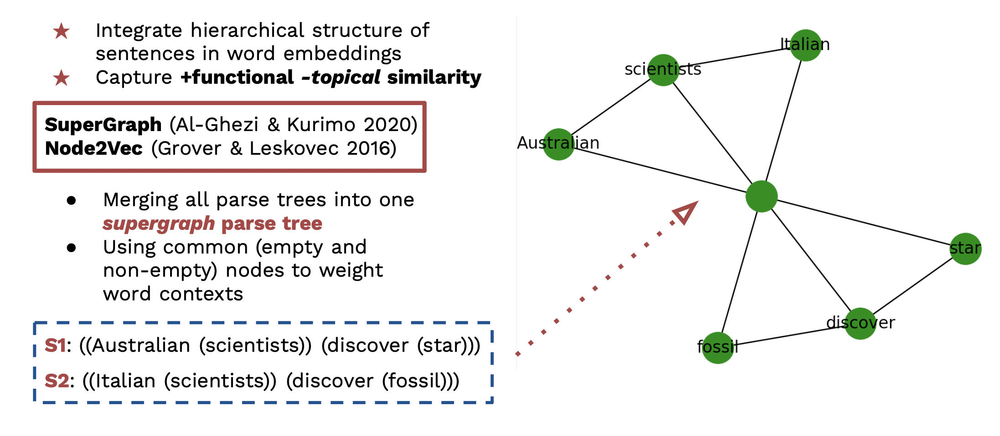

# Ancient Greek Syntactic Word Embeddings
> __Warning__: This work is ongoing: contact me to get more information on current experiments not included here yet.
Train syntactic word embeddings from Ancient Greek treebanks (PROIEL or AGDT annotation schemes).

## Installation
### Prerequisites
The setup relies on the integration of [`pyenv`](https://github.com/pyenv/pyenv) and [`poetry`](https://python-poetry.org). Make sure you first install `pyenv` following [these instructions](https://github.com/pyenv/pyenv#installation) and `poetry` following [these instructions](https://python-poetry.org/docs/#installation).

### Clone the project
```
git clone https://github.com/npedrazzini/ancientgreek-syntactic-embeddings.git
```

### Install Python version (pyenv)
Install `python 3.10.1`. This is the version on which this project has been tested (on MacOS and Linux/Ubuntu), so there is no guarantee that everything will run smoothly on other Python versions. To install it run:

```
pyenv install 3.10.1
```

And set it as the `global` version:

```
pyenv global 3.10.1
```

Restart the terminal for the changes to take effect:

```
exec bash -l
```

### Install virtual env and project dependencies (poetry)

Change directory to the current project:

```
cd ancientgreek-syntactic-embeddings
```

Create virtual environment and install project dependencies:

```
poetry install
```

Then to start using the project scripts, activate the virutal environment:

```
poetry shell
```

You can now run a `.py` script as usual, for example:

```
python scripts/training/train_diach_emb.py
```

## Data
Ancient Greek treebank in the PROIEL or AGDT formats can be downloaded from the following sources.
- PROIEL:
    1. PROIEL AG treebank: 
- AGDT:
    1. Gorman treebank:
    2. Papyri treebank: 
    3. Pedalion treebank: 
    4. Perseus treebank: 

## Graph-Based Syntactic Word Embeddings
<p align="center">

</p>
<p align="center">
Fig. 1 - From <i>Evaluating Language Models for Ancient Greek: Design, Challenges, and Future Directions </i> (paper presented by Barbara McGillivray, Silvia Stopponi, Nilo Pedrazzini, Malvina Nissim & Saskia Peels-Matthey at International Conference of Historical Linguistics, ICHL 2022, Oxford, United Kingdom).

</p>

This is a modified version of the implementation of Al-Ghezi and Kurimo's (2020) [[2]](#2) framework to learn syntactic embeddings based on multiple constituency parse trees merged into one 'supergraph'. The embeddings are then trained using [`node2vec`](https://snap.stanford.edu/node2vec/)  [[3]](#3).

You can generate parse trees from Ancient Green treebank in either the [PROIEL]() or the [AGDT](https://github.com/PerseusDL/treebank_data/blob/master/AGDT2/guidelines/Greek_guidelines.md#auxp) annotation scheme. Follow the steps below to process either.

### Pre-processing

First convert Ancient Greek treebanks following the PROIEL or AGDT schemes (and .xml formats) to parenthetical/parse tree, without the dependency tag (needed as input to node2vec). 

> __Note__: we use lemmas, not token forms, and we remove stopwords. Multiple empty parentheses are kept because they indicate an empty node.

There are separate scripts for the PROIEL and the AGDT schemes:

For PROIEL-formatted treebanks:

```
python ./scripts/preprocess/xml-to-parenth-proiel.py
```

For AGDT-formatted treebanks:
```
python ./scripts/preprocess/xml-to-parenth-agdt.py
```

> __Note__: the above assume you have all .xml files under one `./PROIEL_treebanks/` and `./AGDT_treebanks/` folder. If you have them in a different structure, make sure you adjust the variables `allproiel` and `allagdt` respectively before running the scripts.

After running either or both of the above, make sure you run:

```
python ./scripts/preprocess/mergetrees.py
```

This will generate a `tree.txt` file, containing all parenthetical trees you wish to use to train the node2vec model.


#### Training
After generating parse trees using the preprocessing scripts provided, you should now have a `tree.txt` under `outputs/<modelname>/`. This will be the input of the training script. You do not need to change anything in the script. When you run it, you will only be asked in enter the `<modelname>` directly in the terminal and the script will find the right file for you.

Run:

```
train.py
```

This will train a `node2vec` model, saving the output vectors as in a `.txt` file, in non-binary format which can then be explored using `gensim.KeyedVector` as usual. You can find a minimal example of exploration script in `scripts/exploration/most_similar.py`.


## References

<a name="1">[1]</a> Omer Levy and Yoav Goldberg. 2014. Dependency-Based Word Embeddings. In <i> Proceedings of the 52nd Annual Meeting of the Association for Computational Linguistics </i> (Volume 2: Short Papers), pages 302–308, Baltimore, Maryland. Association for Computational Linguistics.


<a name="2">[2]</a> Ragheb Al-Ghezi and Mikko Kurimo. 2020. Graph-based Syntactic Word Embeddings. In <i> Proceedings of the Graph-based Methods for Natural Language Processing (TextGraphs)</i>, pages 72–78, Barcelona, Spain (Online). Association for Computational Linguistics. https://aclanthology.org/2020.textgraphs-1.8.pdf

<a name="3">[3]</a> Aditya Grover and Jure Leskovec. 2016. node2vec: Scalable Feature Learning for Networks. In <i>Proceedings of the 22nd ACM SIGKDD International Conference on Knowledge Discovery and Data Mining</i>.